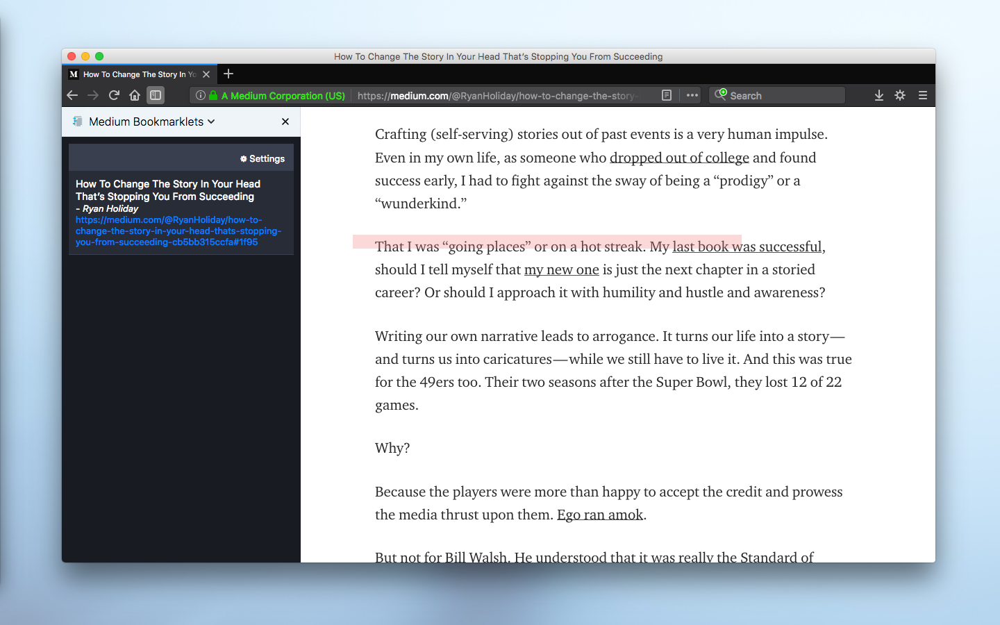

#  Medium Bookmarklets
> Easy way to save your place in Medium articles and return to them later.

Do you ever find yourself reading articles on Medium then adding the article to your Bookmarks because you don'y have time to finish it? Maybe because you're reading on your commute to work and your stop is approaching, or at night before bed and you're getting sleepy. And if the article is particulary long, you may also forget where you last left off since the last time you were reading that article. Adding it to your Bookmarks may not be the best solution - that's where **Medium Bookmarklets** comes in.

With **Medium Bookmarklets**, you can save your spot in any Medium article. After doing so, a card for that Medium article will populate in the **Medium Bookmarklets** sidebar which allows you to select the card and it will direct you to the exact spot that you placed your *bookmarklet*. See how it works below!

<p align="center">
  
</p>

**View the [demonstration video on YouTube](https://youtu.be/1s8P4-ZKylI).**

## Install

Currently, Medium Bookmarklets is only available for Firefox. Click the button below to get it from AMO (addons.mozilla.org):

<p align="left">
  <a href="https://addons.mozilla.org/en-US/firefox/addon/medium-bookmarklets/">
    
  </a>
</p>

## How to Use

#### Adding Bookmarklets:
Adding a bookmarklet is synonymous with adding a bookmark to a book: it allows you to easily come back to
the article later so you can pick up right where you left off, no need to scroll through long articles.

 - After installing, head over to https://medium.com and select an article to read.
 > **Note:** adding bookmarklets will not work with many publications right out of the box. To fix this, add the domain of the publication (e.g. medium.freecodecamp.org or codeburst.io) in the Settings section.
 - Once you're ready to stop reading, highlight the paragraph / heading / quote that you wish to return to later.
 - With the text highlighted, press <kbd>B</kbd>.
 - A lightcoral line (referred to as a *bookmarklet highlight*) that's offset from the the text should have appeared. Inspecting the sidebar, you will see a card containing the article's title, author, and url should have also appeared.
 
#### Updating Bookmarklets:
Because you can only have one bookmarklet per Medium article, you might want to move the current bookmarklet ahead if the
article is especially long. To do so:

 - Highlight the new text where you want to place the new bookmarklet highlight.
 - Press <kbd>B</kbd>.
 
This will move the bookmarklet highlight and also automatically update the bookmarklet card in the sidebar.
 
#### Removing Bookmarklets:
 - Click on the bookmarklet highlight in the Medium article. The bookmarklet card in the sidebar will automatically be deleted.
  
#### Viewing Bookmarklets:
To get back to your place in Medium articles:

 - Open the sidebar, find the bookmarklet card that corresponds to the article you want to continue reading.
 - Click anywhere on that card.
 - The current browser tab will open the respective Medium article, taking you exactly where the bookmarklet highlight was added.

## Contributing

Suggestions and pull requests are highly encouraged!
In order to make modifications to the extension you'd need to run it locally. Having [`web-ext`](https://github.com/mozilla/web-ext) installed, follow the steps below:

```sh
git clone https://github.com/cedricium/medium-bookmarklets.git
cd medium-bookmarklets
web-ext run     # Run the extension in Firefox
OR
web-ext build   # Create an extension package from source
```

## License

[MIT](LICENSE.md)