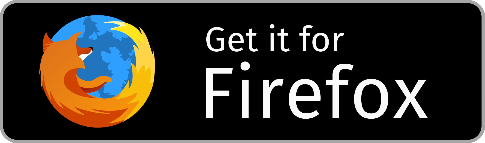

#  Medium Bookmarklets
> Easy way to save your place in Medium articles and return to them later.

Do you ever find yourself reading articles on Medium then adding the article to your Bookmarks because you don'y have time to finish it? Maybe because you're reading on your commute to work and your stop is approaching, or at night before bed and you're getting sleepy. And if the article is particulary long, you may also forget where you last left off since the last time you were reading that article. Adding it to your Bookmarks may not be the best solution - that's where **Medium Bookmarklets** comes in.

With **Medium Bookmarklets**, you can save your spot in any Medium article. After doing so, a card for that Medium article will populate in the **Medium Bookmarklets** sidebar which allows you to select the card and it will direct you to the exact spot that you placed your *bookmarklet*. See how it works below!

**View the [demonstration video on YouTube](https://youtu.be/1s8P4-ZKylI).**

## Install

Currently, Medium Bookmarklets is only available for Firefox. Click the button below to get it from AMO (addons.mozilla.org):

<p align="left">
  <a href="https://addons.mozilla.org/en-US/firefox/addon/medium-bookmarklets/">
    
  </a>
</p>

## How to Use

 - After installing, head over to https://medium.com and select and article to read.
 > **Note:** adding bookmarklets will not work with many publications right out of the box. To fix this, add the domain of the publication (e.g. medium.freecodecamp.org or codeburst.io) in the Settings section.
 - Once you're ready to stop reading, highlight the paragraph / heading / quote that you wish to return to later.
 - With the text highlighted, press <kbd>B</kbd>.
 - A lightcoral line (referred to as a *bookmarklet*) that's offset from the the text should have appeared. Inspecting the sidebar, you will see a card containing the article's title, author, and url should have also appeared.
 - When you're ready to begin reading, simply click on the card in the sidebar. This will take you to the exact spot in the article where the *bookmarklet* was placed.

 ## Contributing

Suggestions and pull requests are highly encouraged!
In order to make modifications to the extension you'd need to run it locally. Having `[web-ext](https://github.com/mozilla/web-ext)` installed, follow the steps below:

```sh
git clone https://github.com/cedricium/medium-bookmarklets.git
cd medium-bookmarklets
web-ext run     # Run the extension in Firefox
OR
web-ext build   # Create an extension package from source
```

## License

[MIT](LICENSE.md)